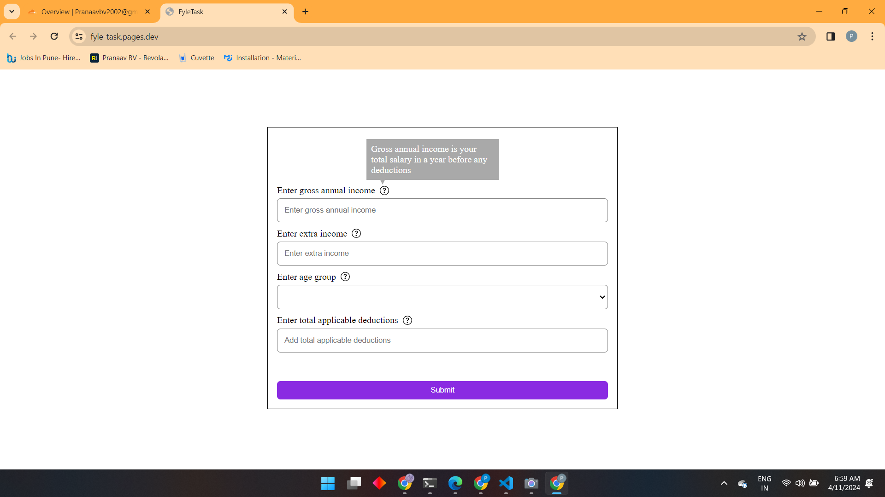
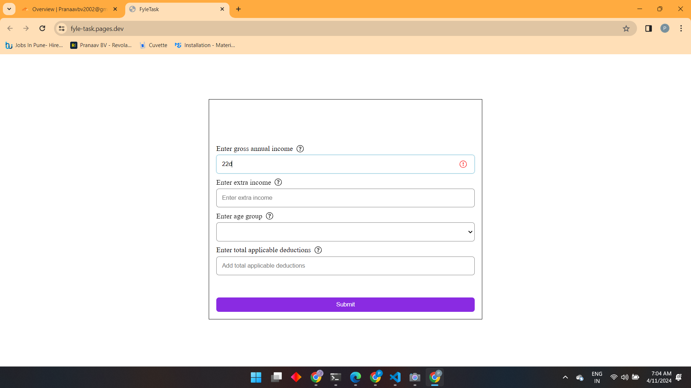
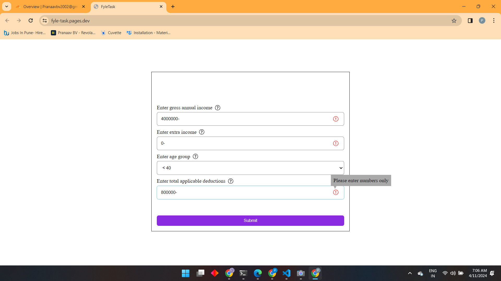
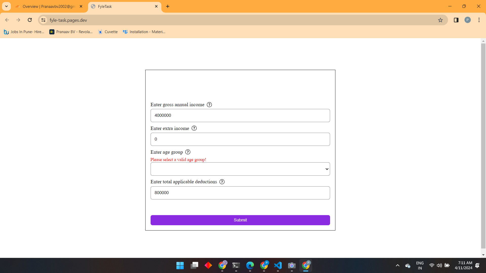
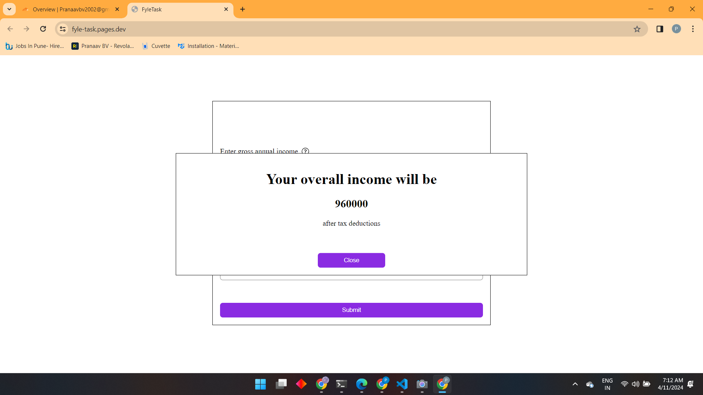
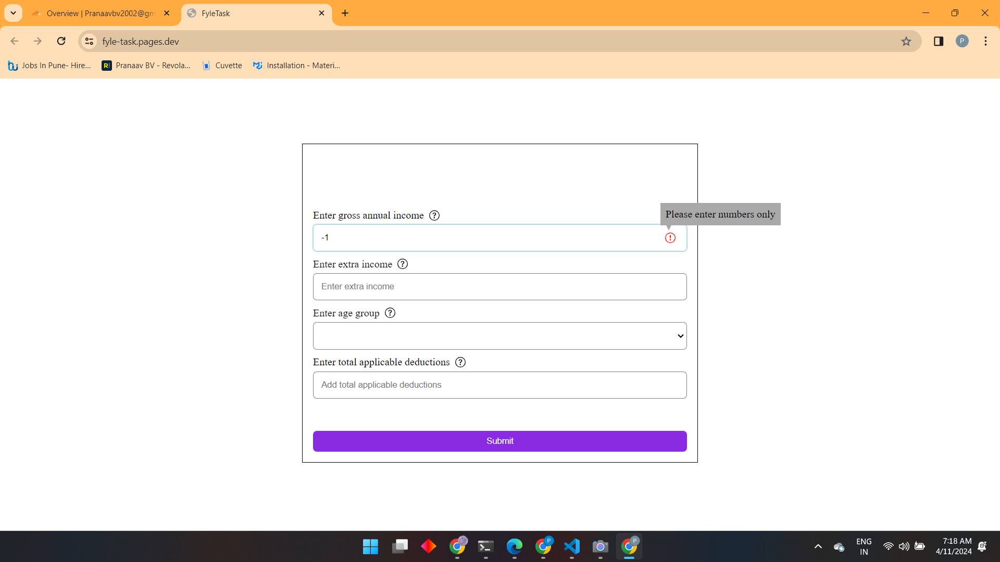
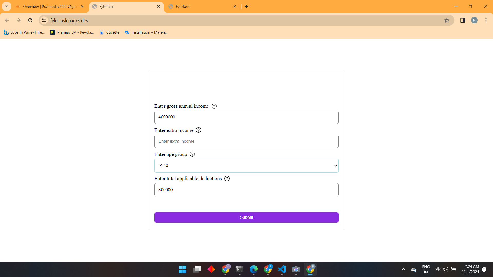

# Project Details

This is the completed project of the challenge outline: "Tax Calculator"

## Edge Cases Looked At

- Overall income (after deductions) under 8 (≤) Lakhs is not taxed.
- Income over 8 (>) Lakhs, the amount over 8 Lakhs is taxed at:
  - 30% for people with age < 40
  - 40% for people with age ≥ 40 but < 60
  - 10% for people with age ≥ 60
- Error handling and displaying in all number fields
- age dropdown options:
  - <40
  - ≥ 40 & < 60
  - ≥ 60
  - If user has not entered this value and clicks on submit, show a error icon hovering over which should show that input field is mandatory
- Error icons should not be visible in the form by default.
- Clicking on submit should show a modal which would show the final values based on above calculations.

## Images

*Caption: Information Container on hover*

*Caption: No error when number is shown*

*Caption: Error with character*

*Caption: Error handling in all input fields*

*Caption: No Age Value Error Handling*

*Caption: Matching given Test Case*

## Individual Edge Cases

*Caption: No negative value*

*Caption: No Value Added, means the value = 0*

